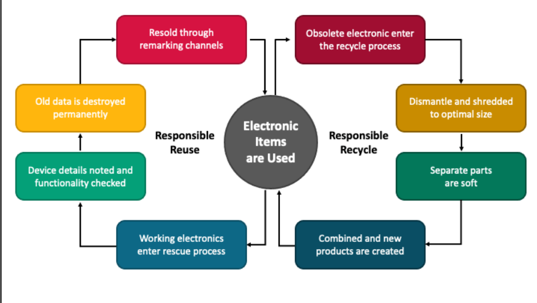

# Smart India Hackathon Workshop
# Date:
## Register Number:
## Name:
## Problem Title
E-Waste Facility Locator
## Problem Description
Website that tells you the location of the nearest e-waste collection and recycling facility. Offers educational pop-ups on the harmful components of your e-waste and their effects on the environment and human health if not disposed correctly. There could be an option to input the model of your old device and earn credit points relative to the amount of precious metals recovered from the device if disposed correctly.
## Problem Creater's Organization
Ministry of Environment

## Idea
The main idea of an e-waste facility locator is to provide a comprehensive, user-friendly platform that helps individuals, businesses, and organizations find nearby electronic waste recycling facilities. This service aims to facilitate the proper disposal and recycling of electronic waste (e-waste), which includes old or discarded electronic devices such as computers, smartphones, televisions, and other electronic equipment.

## Proposed Solution / Architecture Diagram

## Use Cases
Consumer Use Case:
Description: Consumers can find nearby e-waste recycling facilities to responsibly dispose of their electronic waste.
Features: 
1) Search for facilities based on location.
2) View facility details, operating hours, accepted items, and contact information.
3) Get directions to the facility.
4) Schedule pickups if available.

Business Use Case:
Description: Businesses can locate bulk e-waste disposal services and ensure compliance with regulations.
Features:
1) Bulk scheduling and pickup coordination.
2) Access to compliance and certification details.
3) Integration with inventory management systems for large-scale disposals.

Government Use Case:
Description: Government agencies can monitor and promote e-waste recycling practices within their jurisdictions.
Features:
1) Track facility usage and e-waste volumes.
2) Analyze geographical distribution of e-waste recycling centers.
3) Generate reports for policy making and public awareness campaigns.

Environmental Organization Use Case:
Description: NGOs and environmental organizations can use the data to track e-waste disposal trends and promote responsible practices.
Features:
1) Data analysis tools for environmental impact studies.
2) Campaign management to increase public participation in e-waste recycling.
3) Collaboration with facilities for awareness programs.

## Technology Stack
1.Frontend:
Frameworks: React.js, Vue.js Description: Develop a responsive web interface and mobile application for seamless user interaction and accessibility.

2.Backend:
Languages: Python, Node.js Database: MongoDB, PostgreSQL Description: Build a robust backend system to manage user data, facility information, and credit points transactions.

3.Geolocation Services:
API: Google Maps API, Mapbox API Description: Utilize geolocation services to provide accurate location-based information on e-waste collection facilities.

4.Notification System:
Service: Twilio, Firebase Cloud Messaging Description: Implement a notification system to send alerts and reminders to users regarding e-waste disposal and recycling options.

## Dependencies

1.Collaboration with E-Waste Facilities:
Establish partnerships with e-waste collection and recycling facilities to integrate their services into the platform.

2.Regulatory Compliance:
Ensure compliance with local regulations and environmental standards for e-waste management and recycling.

3.Public Engagement:
Collaborate with environmental organizations and community groups to promote the platform and encourage public participation in responsible e-waste disposal.

4.Technological Infrastructure:
Depend on reliable internet connectivity and technological infrastructure to support the platform's functionalities and user engagement.
